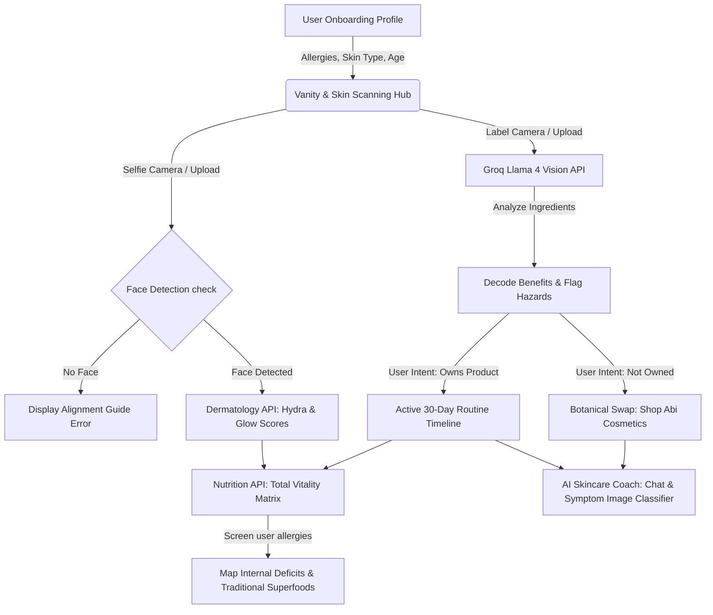

# 🌸 Bloomy (AuraLens) Beauty Analysis

> **A Premium AI-Powered Visual Cosmetics Label Decoder, Skin Dermatology Scanner, and Indigenous Ethiopian Superfood Nutrition System.**
> Built with Next.js 16, React 19, Tailwind CSS v4, Framer Motion, and Meta-Llama 4 Scout.

---

## 🌟 Visual Workflow Architecture

Bloomy orchestrates advanced visual processing, database synchronization, and LLM orchestration to deliver high-fidelity skincare routines.



---

## 🚀 Core Features

### 🔍 Bottle Vision Decoder (LLM Label Scanner)
- **Vision Model**: Driven by the `meta-llama/llama-4-scout-17b-16e-instruct` model on Groq.
- **Targeted Analysis**: Extracts brand name, product name, organic alternatives, and key chemical compounds.
- **Dynamic Adjustments**: Automatically recalculates hazard levels (Medium vs. High) based on user age, gender, and skin type.
- **File Reference**: [analyze/route.ts](file:///c:/Users/suraf/Documents/auralens-beauty-analysis/src/app/api/analyze/route.ts).

### 🤳 Skin Dermatology Scanner (Selfie Analyst)
- **Dermatological Assessment**: Examines selfies to score hydration levels (`Hydra Level` 0-100%) and skin radiance (`Glow Index` 0-100%).
- **Verification Rule**: Performs face verification. If a clear human face is not aligned in the oval camera frame, it halts and reports an alignment error.
- **File Reference**: [analyze-skin/route.ts](file:///c:/Users/suraf/Documents/auralens-beauty-analysis/src/app/api/analyze-skin/route.ts).

### 📈 Interactive Vanity Workspace & 30-Day Projector
- **Active Tracker**: Select a product from the Vanity Shelf to project a customized 30-day skincare milestone calendar:
  - **Day 3**: Initial Calming & Reaction check.
  - **Day 14**: Barrier Reset & Cellular Turnover peak.
  - **Day 30**: Full Skin Transformation & Radiance lock-in.
- **Consistency Logging**: Easily log daily application status ("Applied" vs. "Log Use").
- **File Reference**: [DashboardHub.tsx](file:///c:/Users/suraf/Documents/auralens-beauty-analysis/src/components/auralens/DashboardHub.tsx).

### 🥗 Total Vitality Matrix (Ethiopian Superfoods Engine)
- **Nutritional Synergy**: Analyzes chemical exposures from vanity products and active skin types to identify internal nutrient deficits.
- **Traditional Formulations**: Recommends customized preparation methods for Ethiopian superfoods:
  - **Telba (ተልባ / Flaxseed)**: Omega-rich lipid barrier restoration.
  - **Habba Soda (ሃባ ሶዳ / Black Seed)**: Anti-inflammatory scalp health and hair growth.
  - **Shiferaw (ሺፈራው / Moringa)**: High-density vitamins for nail plate structure.
  - **Besso (በሶ) & Teff (ጤፍ)**: Cellular restoration and intestinal biome support.
- **Allergen Screening**: Strict rules filter out any superfood recommendations containing or derived from user-flagged food allergies.
- **Marketplace Links**: Integrates with `wevasphere.market` for raw materials and Kuriftu Resorts for organic dining menus.
- **File Reference**: [NutritionInsights.tsx](file:///c:/Users/suraf/Documents/auralens-beauty-analysis/src/components/auralens/NutritionInsights.tsx).

### 💬 Live AI Skincare Coach (Symptom Classifier)
- **Consultation Log**: Real-time messaging with the "Bloomy Coach".
- **Symptom Uploads**: Users can snap photos of skin issues. The coach assesses visible signs of contact dermatitis, scaling, or purging, recommends natural soothing solutions (e.g. Telba gel, honey balm), and advises whether to pause the product.
- **File Reference**: [chat/route.ts](file:///c:/Users/suraf/Documents/auralens-beauty-analysis/src/app/api/chat/route.ts).

### 🌐 Real-Time Bilingual System (English / Amharic)
- **Locale Toggling**: Instant translation of all pages, layouts, and drawer components between English and Amharic.
- **Deep Translation**: vision prompts command Llama-4 to translate nested JSON values (benefits, superfoods, timelines) into natural Ge'ez script while leaving programmatic keys intact.
- **File Reference**: [translations.ts](file:///c:/Users/suraf/Documents/auralens-beauty-analysis/src/lib/translations.ts).

### 🧪 Presentation Sandbox Override
- **Bypass Feature**: Tapping the "Bloomy" title header **5 times** in the Vanity Hub triggers a Presentation Sandbox Override.
- **Purpose**: Enables testing and offline client reviews by feeding simulated camera results and mock responses without requesting API keys.
- **File Reference**: [VanityHub.tsx](file:///c:/Users/suraf/Documents/auralens-beauty-analysis/src/components/auralens/VanityHub.tsx).

---

## 📂 Project Directory & Clickable Matrix

| Folder / File | Type | Purpose | File Link |
| :--- | :--- | :--- | :--- |
| **`src/app/`** | Directory | App router page declarations and layout styling. | [app/](file:///c:/Users/suraf/Documents/auralens-beauty-analysis/src/app) |
| ↳ `page.tsx` | File | Core home router routing between Vanity Hub, Dashboard, and History. | [page.tsx](file:///c:/Users/suraf/Documents/auralens-beauty-analysis/src/app/page.tsx) |
| ↳ `onboarding/page.tsx` | File | Multi-step user onboarding (allergies, age, skin type, gender). | [page.tsx](file:///c:/Users/suraf/Documents/auralens-beauty-analysis/src/app/onboarding/page.tsx) |
| ↳ `history/page.tsx` | File | Chronological scan log list and the Skincare AI Coach chat interface. | [page.tsx](file:///c:/Users/suraf/Documents/auralens-beauty-analysis/src/app/history/page.tsx) |
| **`src/components/`** | Directory | Highly reusable interactive React components. | [components/](file:///c:/Users/suraf/Documents/auralens-beauty-analysis/src/components) |
| ↳ `CameraMatrix.tsx` | Component | Dual-mode capture (face vs. bottle) with square scaling & base64 encoding. | [CameraMatrix.tsx](file:///c:/Users/suraf/Documents/auralens-beauty-analysis/src/components/auralens/CameraMatrix.tsx) |
| ↳ `DashboardHub.tsx` | Component | Manage view presenting active skin type, metric meters, and 30-day timeline. | [DashboardHub.tsx](file:///c:/Users/suraf/Documents/auralens-beauty-analysis/src/components/auralens/DashboardHub.tsx) |
| ↳ `NutritionInsights.tsx` | Component | Total Vitality Matrix rendering superfoods, nutrients, and WeVa integration. | [NutritionInsights.tsx](file:///c:/Users/suraf/Documents/auralens-beauty-analysis/src/components/auralens/NutritionInsights.tsx) |
| ↳ `SynergySheet.tsx` | Component | Bottom-sheet presenting benefits, hazards, and alternative botanical swaps. | [SynergySheet.tsx](file:///c:/Users/suraf/Documents/auralens-beauty-analysis/src/components/auralens/SynergySheet.tsx) |
| ↳ `VanityHub.tsx` | Component | Scan initiation screen, sandbox activation, and active trackers. | [VanityHub.tsx](file:///c:/Users/suraf/Documents/auralens-beauty-analysis/src/components/auralens/VanityHub.tsx) |
| **`src/lib/`** | Directory | Core database drivers, configurations, and utilities. | [lib/](file:///c:/Users/suraf/Documents/auralens-beauty-analysis/src/lib) |
| ↳ `db.ts` | File | Local storage DB driver with on-the-fly migration from `auralens:` to `bloomy:`. | [db.ts](file:///c:/Users/suraf/Documents/auralens-beauty-analysis/src/lib/db.ts) |
| ↳ `translations.ts` | File | Dictionary of localized terms for English and Amharic toggles. | [translations.ts](file:///c:/Users/suraf/Documents/auralens-beauty-analysis/src/lib/translations.ts) |

---

## 🛠️ API Specifications & Payloads

### 1. Cosmetics Label Scanner (`POST /api/analyze`)
Extracts ingredients from label images and flags hazards tailored to user properties.
* **Payload Format**:
  ```json
  {
    "imageBase64": "string",
    "skinType": "Dry" | "Oily" | "Sensitive" | "Acne-Prone",
    "age": "string",
    "gender": "Female" | "Male",
    "allergies": ["string"],
    "locale": "en" | "am"
  }
  ```
* **Returns**:
  ```json
  {
    "ok": true,
    "result": {
      "brand": "string",
      "productName": "string",
      "isProductSafe": true,
      "benefits": [{ "name": "string", "description": "string", "details": "string" }],
      "hazards": [{ "name": "string", "riskLevel": "High" | "Medium", "description": "string", "details": "string" }],
      "alternativeProduct": { "brand": "string", "name": "string", "reason": "string" },
      "usageDetails": {
        "howToUse": "string",
        "whenToUse": "string",
        "timeline": { "day3": "string", "day14": "string", "day30": "string" }
      }
    }
  }
  ```

### 2. Skin Dermatology Scanner (`POST /api/analyze-skin`)
Determines skin hydration and radiance from facial selfies.
* **Payload Format**:
  ```json
  {
    "imageBase64": "string",
    "locale": "en" | "am"
  }
  ```
* **Returns** (Face Detected):
  ```json
  {
    "ok": true,
    "result": {
      "skinType": "Dry" | "Oily" | "Sensitive" | "Acne-Prone",
      "hydraScore": 85,
      "glowScore": 79,
      "primaryFocus": "string"
    }
  }
  ```
* **Returns** (No Face Detected):
  ```json
  {
    "ok": false,
    "error": "No human face detected. Please capture a clear selfie..."
  }
  ```

### 3. Nutrition Insights Generator (`POST /api/analyze-nutrition`)
Generates internal nutritional plans based on the skincare products used and allergen profiles.
* **Payload Format**:
  ```json
  {
    "profile": { "skinType": "string", "age": "string", "gender": "string", "allergies": ["string"] },
    "products": [{ "brand": "string", "productName": "string", "isProductSafe": true }],
    "locale": "en" | "am"
  }
  ```
* **Returns**:
  ```json
  {
    "ok": true,
    "result": {
      "focus": "string",
      "nutrients": [{ "name": "string", "why": "string", "foods": ["string"] }],
      "superfoods": [{ "name": "string", "localName": "string", "prep": "string" }],
      "outerBodySynergy": "string"
    }
  }
  ```

### 4. Skincare Coach Chat (`POST /api/chat`)
Answers questions about product adjustment or evaluates skin symptom photos.
* **Payload Format**:
  ```json
  {
    "messages": [{ "sender": "user" | "ai", "text": "string", "image": "string (optional base64)" }],
    "profile": { "skinType": "string", "age": "string" },
    "product": { "brand": "string", "productName": "string" },
    "locale": "en" | "am"
  }
  ```
* **Returns**:
  ```json
  {
    "ok": true,
    "reply": "string"
  }
  ```

---

## 💿 Developer Setup & Launch Guide

> [!IMPORTANT]
> A valid `GROQ_API_KEY` is required in your local variables to query vision models. Create a `.env.local` file in the project root.

```bash
# Clone or navigate to the workspace
cd surazy/auralens-beauty-analysis

# Install dependencies (React 19 & Next.js 16)
npm install

# Setup local environment variables
echo "GROQ_API_KEY=your_key_here" > .env.local

# Run the local development server
npm run dev
```

Open [http://localhost:3000](http://localhost:3000) on your local browser. 

> [!TIP]
> If you don't have a live Groq key, tap the **Bloomy** title header **5 times** to run in offline sandbox mode.
